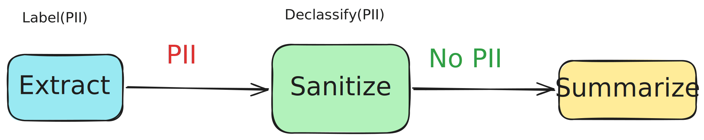

# Using Access Control Policies

When multiple teams share a pool of LLM backends, you need to control who can use which models, which tools are available to each team, and whether sensitive data may flow to external providers. Orla lets you install access control policies at runtime through the same API you use to register backends and run inference. Every request is checked inside the daemon, so enforcement is consistent whether the caller uses pyorla, LangGraph, or the HTTP API directly.

You tag each request with the identity of the caller, such as a tenant or team name, and install policies that match those tags against resource patterns. The evaluation model works in four steps. First, if any deny policy matches, the request is denied regardless of allow rules. Second, if any allow policy matches, the request is allowed. Third, if the subject has policies for this resource type but none matched the specific resource, the request is denied. Fourth, if no policies target this subject for this resource type at all, the request is allowed.

This means you can adopt access control incrementally. Subjects without policies are unaffected. Once you install any policy for a subject, that subject is under access control and needs explicit allows for the resource types those policies cover. Having backend policies for a subject does not affect its tool access, and vice versa.

Since Orla runs as a long-lived daemon, policy management and agent development are naturally decoupled. An infrastructure or security team registers backends, installs policies, and manages access rules through the API. Application teams write LangGraph pipelines and tag their stages with their tenant identity. They never need to know what policies exist, and the policy team never needs to read the agent code. The daemon is the central enforcement point, sitting between the two. This separation mirrors the SDN model of separating control and data planes. One team programs the rules, another team sends the traffic, and the system enforces the rules transparently.

This page walks through a document analysis pipeline built with LangGraph, where interns, engineers, and researchers share three model tiers under different access rules.

## Document analysis pipeline with LangGraph

We build a two-stage LangGraph pipeline. An extract stage reads a document and pulls out key facts, then a summarize stage produces a concise summary. Different teams get different backend access. Interns can only use the cheap model, engineers get cheap and mid-tier, and the research team gets everything including the expensive frontier model.

On top of backend restrictions, tool policies prevent interns from querying the HR database, and data policies prevent PII-labeled documents from reaching external models, even in downstream stages that never explicitly touched PII.

The full runnable example lives in the Orla repo under `pyorla/examples/access_control_demo/`.

## Register backends

Each backend needs a name, endpoint, quality score, and cost model. Policy matching uses the backend name, so pick names that are easy to write glob patterns against.

```python
from pyorla import LLMBackend, orla_runtime
from pyorla.types import CostModel

with orla_runtime(quiet=True) as client:
    cheap = LLMBackend(
        name="cheap",
        endpoint="https://bedrock-mantle.us-east-2.api.aws/v1",
        type="openai",
        model_id="openai:mistral.ministral-3-3b-instruct",
        api_key_env_var="OPENAI_API_KEY",
        quality=0.30,
        cost_model=CostModel(
            input_cost_per_mtoken=0.10,
            output_cost_per_mtoken=0.10,
        ),
    )
    mid = LLMBackend(
        name="mid",
        endpoint="https://bedrock-mantle.us-east-2.api.aws/v1",
        type="openai",
        model_id="openai:qwen.qwen3-32b-v1:0",
        api_key_env_var="OPENAI_API_KEY",
        quality=0.60,
        cost_model=CostModel(
            input_cost_per_mtoken=0.15,
            output_cost_per_mtoken=0.60,
        ),
    )
    strong = LLMBackend(
        name="strong",
        endpoint="https://bedrock-mantle.us-east-2.api.aws/v1",
        type="openai",
        model_id="openai:qwen.qwen3-235b-a22b-2507-v1:0",
        api_key_env_var="OPENAI_API_KEY",
        quality=0.90,
        cost_model=CostModel(
            input_cost_per_mtoken=0.53,
            output_cost_per_mtoken=2.66,
        ),
    )
    for b in (cheap, mid, strong):
        client.register_backend(b)
```

All three models are open-weight and can be self-hosted with vLLM or Ollama. This example uses [Amazon Bedrock Mantle](https://docs.aws.amazon.com/bedrock/latest/userguide/bedrock-mantle.html), but you can point `endpoint` at any OpenAI-compatible server.

## Install access control policies

Policies are installed through the same client. Each policy has a name, subject patterns that match against request tags, resource patterns that match against backend names or tool names or data labels, and an action: either `allow` or `deny`.

```python
from pyorla import AccessPolicy
from pyorla.types import ACCESS_ACTION_ALLOW, ACCESS_ACTION_DENY

# Interns: allow only cheap. No deny needed. Once interns have any backend
# policy, backends without an explicit allow are denied automatically.
client.add_policy(AccessPolicy(
    name="intern-allow-cheap",
    subjects=["tenant:interns"],
    resources=["backend:cheap"],
    action=ACCESS_ACTION_ALLOW,
))

# Engineering: allow all backends, then deny strong.
client.add_policy(AccessPolicy(
    name="eng-allow-all",
    subjects=["tenant:engineering"],
    resources=["backend:*"],
    action=ACCESS_ACTION_ALLOW,
))
client.add_policy(AccessPolicy(
    name="eng-deny-strong",
    subjects=["tenant:engineering"],
    resources=["backend:strong"],
    action=ACCESS_ACTION_DENY,
))

# Research: no policies at all, so unmanaged and open by default.
```

Subjects and resources support glob patterns. `backend:*` matches every backend, `tool:query_*` matches any tool whose name starts with `query_`, and `tenant:*` matches any tenant tag.

## Tag your LangGraph stages

Access control kicks in when a request carries tags. You set tags on each Stage, and they flow through to every inference call that Stage makes, including when used as a LangChain chat model inside LangGraph.

```python
from pyorla import Stage

extract_stage = Stage("extract", cheap)
extract_stage.client = client
extract_stage.set_tags({"tenant": "interns"})
extract_stage.set_temperature(0.0)
extract_stage.set_max_tokens(512)

summarize_stage = Stage("summarize", mid)
summarize_stage.client = client
summarize_stage.set_tags({"tenant": "engineering"})
summarize_stage.set_temperature(0.3)
summarize_stage.set_max_tokens(256)
```

When the extract stage calls `extract_stage.as_chat_model().invoke(...)` inside a LangGraph node, the daemon checks the request tags against installed policies before selecting the backend. If the intern tag hits a deny rule for that backend, the request fails with a 403 before any inference happens.

If you use `Workflow` instead of LangGraph, you can set tags at the workflow level and they propagate to all stages:

```python
from pyorla import Workflow

wf = Workflow(client, tags={"tenant": "engineering"})
wf.add_stage(extract_stage)
wf.add_stage(summarize_stage)
```

## Build the LangGraph pipeline

The graph itself is standard LangGraph. The only Orla-specific addition is `set_tags` on each Stage. The state, the nodes, the edges all stay the same as any other LangGraph application.

```python
from langgraph.graph import END, START, StateGraph
from langchain_core.messages import HumanMessage, SystemMessage

extract_llm = extract_stage.as_chat_model()
summarize_llm = summarize_stage.as_chat_model()

def extract_node(state):
    reply = extract_llm.invoke([
        SystemMessage(content="Extract the key facts from this document as bullet points."),
        HumanMessage(content=state.messages[-1].content),
    ])
    return {"messages": [reply]}

def summarize_node(state):
    reply = summarize_llm.invoke([
        SystemMessage(content="Write a one-paragraph summary from these facts."),
        HumanMessage(content=state.messages[-1].content),
    ])
    return {"messages": [reply]}

g = StateGraph(DocState)
g.add_node("extract", extract_node)
g.add_node("summarize", summarize_node)
g.add_edge(START, "extract")
g.add_edge("extract", "summarize")
g.add_edge("summarize", END)
pipeline = g.compile()

result = pipeline.invoke({"messages": [HumanMessage(content=document)]})
```

If the intern's extract stage tries to use `mid` or `strong`, the daemon rejects the request before any tokens are generated.

## Tool access control

Tool policies work the same way as backend policies. If a request includes tools that are denied for the caller's tags, the daemon rejects the entire request with a 403.

```python
# Interns can use all tools except the HR database.
client.add_policy(AccessPolicy(
    name="intern-allow-all-tools",
    subjects=["tenant:interns"],
    resources=["tool:*"],
    action=ACCESS_ACTION_ALLOW,
))
client.add_policy(AccessPolicy(
    name="intern-no-hr-db",
    subjects=["tenant:interns"],
    resources=["tool:query_hr_database"],
    action=ACCESS_ACTION_DENY,
))
```

When the intern's stage includes `query_hr_database` in its tool list via `bind_tools`, the deny policy matches and the daemon blocks the request. The model never sees the tool schema. Engineering and research have no tool policies, so they are unmanaged for tools and can use everything.

## Data label access control

Data labels prevent sensitive information from reaching unauthorized backends. You set labels on a Stage, and the daemon checks them against data policies before executing.

```python
# PII cannot flow to the strong external backend.
client.add_policy(AccessPolicy(
    name="pii-no-external",
    subjects=["backend:strong"],
    resources=["data:pii"],
    action=ACCESS_ACTION_DENY,
))

# The extract stage processes an employee record containing PII.
extract_stage.set_data_labels(["pii"])
```

The extract stage runs fine on `cheap` because no policy denies PII for that backend. If you change the backend to `strong`, the daemon rejects the request and the data never leaves the system boundary.

## Data label propagation across stages

In a multi-stage pipeline, sensitive data processed by one stage often flows to downstream stages. Orla propagates data labels automatically along the workflow DAG. If the extract stage carries a PII label, the summarize stage downstream of it inherits that label.

To enable propagation, register the workflow DAG with the daemon. For LangGraph, one call extracts the edges from the compiled graph:

```python
pipeline = g.compile()

# Edges are extracted from the compiled LangGraph automatically.
client.register_workflow_from_langgraph("wf-doc-analysis", pipeline, {
    "extract": extract_stage,
    "summarize": summarize_stage,
})
```

Now when the extract stage runs with PII labels, the daemon records the label and propagates it to the summarize stage through the registered edge. If the summarize stage targets the `strong` backend, the daemon rejects it, even though no one explicitly labeled the summarize stage.

Propagation is conservative. Once a label enters a stage, all transitive descendants inherit it. Labels only propagate downstream, never sideways. Two independent branches in the DAG do not taint each other.

For native Orla workflows, registration is automatic. `Workflow.execute()` sends its dependency graph to the daemon before running stages, so no extra code is needed.

## Declassification

Sometimes a stage explicitly sanitizes sensitive data: stripping names, redacting SSNs, removing PII before the output leaves the organization. In that case, downstream stages should not inherit the PII label. You mark a stage as declassifying specific labels. The stage still inherits the label itself, since it needs to process the raw data and PII policies apply to its own execution. But the label stops there and does not propagate further downstream.

```python
sanitize_stage = Stage("sanitize", mid)
sanitize_stage.client = client
sanitize_stage.set_tags({"tenant": "research"})
sanitize_stage.set_declassifies(["pii"])
```

In a three-stage pipeline the flow looks like this:



The extract stage processes the raw employee record and carries the PII label. The sanitize stage inherits PII, so it cannot use an external backend either, but it strips the label from propagation. The summarize stage downstream of sanitize has no PII label and can safely use the strong external backend.

Register the pipeline the same way as before. Declassifications are picked up automatically from each stage:

```python
g = StateGraph(DocState)
g.add_node("extract", extract_node)
g.add_node("sanitize", sanitize_node)
g.add_node("summarize", summarize_node)
g.add_edge(START, "extract")
g.add_edge("extract", "sanitize")
g.add_edge("sanitize", "summarize")
g.add_edge("summarize", END)
pipeline = g.compile()

client.register_workflow_from_langgraph("wf-sanitized", pipeline, {
    "extract": extract_stage,
    "sanitize": sanitize_stage,
    "summarize": summarize_stage,
})
```

Without the sanitize stage, sending the extract output to `strong` would be denied. With it, the PII label is stripped at the sanitization boundary and the summarize stage runs on the strong backend without restriction. The demo example shows both scenarios side by side.

## Run the demo

The full runnable example lives in `pyorla/examples/access_control_demo/`. It exercises all three policy types across interns, engineering, and research tenants analyzing an employee record:

```bash
cd pyorla
uv sync --group examples

uv run python examples/access_control_demo/run.py
```

The output shows each scenario as `ALLOWED` or `DENIED` with the policy reason:

```
=== Model access ===
  [intern→cheap]      ALLOWED
  [intern→strong]     DENIED  — no allow policy for this resource
  [eng→mid]           ALLOWED
  [eng→strong]        DENIED  — denied by policy eng-deny-strong
  [research→strong]   ALLOWED

=== Tool access ===
  [intern+hr_db]      DENIED  — denied by policy intern-no-hr-db
  [eng+hr_db]         ALLOWED

=== Data label propagation ===
  [pii→mid]           ALLOWED
  [pii→strong]        DENIED  — denied by policy pii-no-external

=== Declassification ===
  [pii→sanitize→strong] ALLOWED
```

Interns have no allow for `strong`, so the request is denied without needing an explicit deny rule. Engineering has a broad allow on all backends with a deny carve-out for `strong`. The research team has no policies at all, so everything is open. PII propagates from the extract stage to the summarize stage through the registered DAG edge, blocking the request on the `strong` backend. When the sanitize stage declassifies PII, the summarize stage runs on `strong` without restriction.

Override the backend endpoint for local testing:

```bash
OPENAI_BASE_URL=http://localhost:8000/v1 uv run python examples/access_control_demo/run.py
```

## The enforcement decision

When a request arrives with tags, Orla runs three checks in order: backends, tools, then data labels. Each check follows the same four-step evaluation:

1. If any deny policy matches the subject and resource, deny.
2. If any allow policy matches, allow.
3. If the subject has policies for this resource type but none matched, deny.
4. If no policies target this subject for this resource type, allow.

Step 3 is what makes managed subjects closed by default. Once you install any backend policy for interns, interns need explicit allows for every backend they should access. But because this is scoped per resource type, adding backend policies for interns does not affect their tool or data access.

Step 4 is what keeps the system open for incremental adoption. Subjects with no policies are unaffected. You can start with zero policies and add restrictions one team at a time.

## Managing policies at runtime

Policies are installed, listed, and removed through the same client API:

```python
# Install or replace a policy.
client.add_policy(AccessPolicy(name="...", subjects=["..."], resources=["..."], action="deny"))

# List all policies.
for p in client.list_policies():
    print(f"{p.name}: {p.action} subjects={p.subjects} resources={p.resources}")

# Remove a policy by name.
client.remove_policy("intern-deny-all")
```

There is no configuration file to edit and no daemon restart needed. You can adjust policies during development or in response to changing requirements.

## Takeaways

Orla's access control gives you fine-grained, runtime-configurable guardrails over who can use which models, tools, and data. Enforcement happens inside the daemon on every request, so it works consistently whether you use pyorla's native Workflow API, LangGraph, or the HTTP API directly.

The policy model is simple. Tags on requests, glob patterns on policies, deny overrides allow. This keeps the common case easy while supporting complex multi-tenant setups through pattern composition. Since policies are installed via the API, you can manage them programmatically, version them alongside your application code, and test them as part of your CI pipeline.

Access control composes with Orla's other features. You can combine it with [cost policies](cost-policies.md) to set per-team spending limits, or with [scheduling policies](scheduling-policies.md) to prioritize certain tenants over others. The tags you set for access control are orthogonal to the accuracy and scheduling hints on each request.
