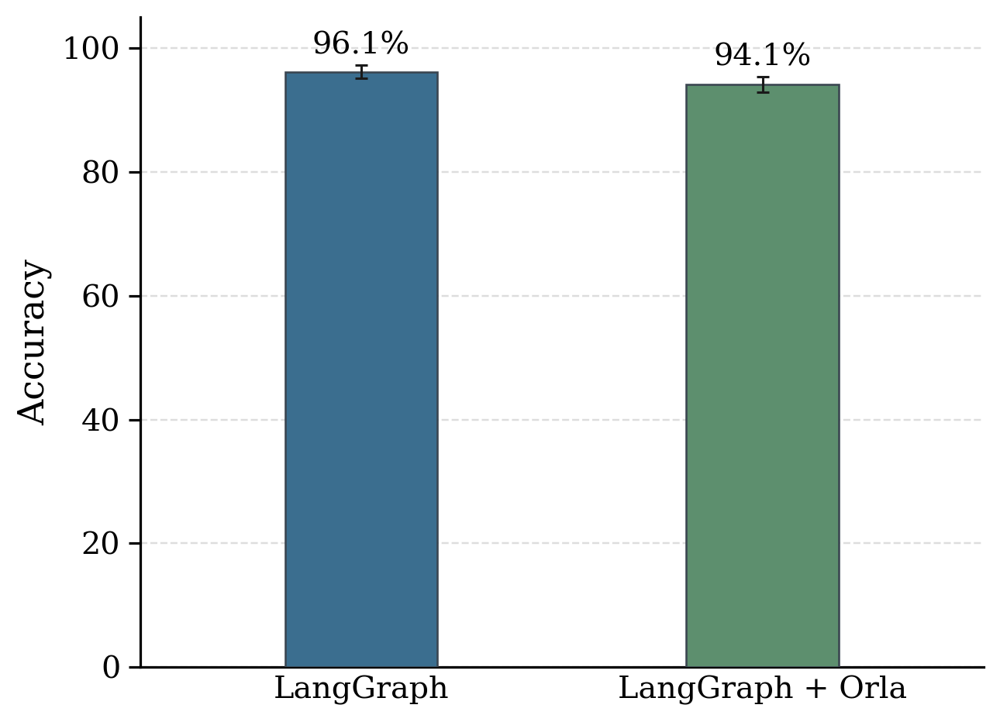
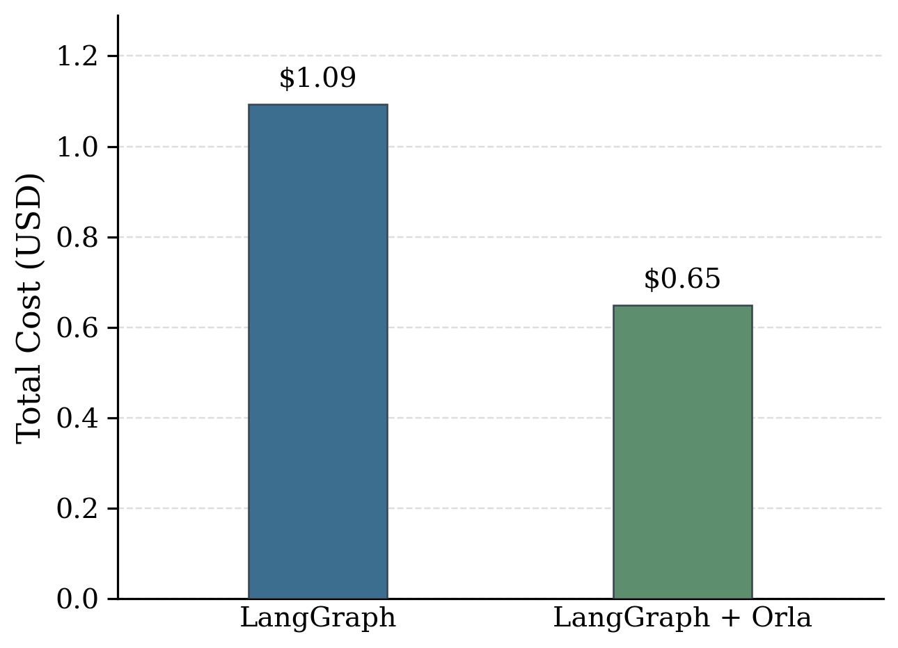
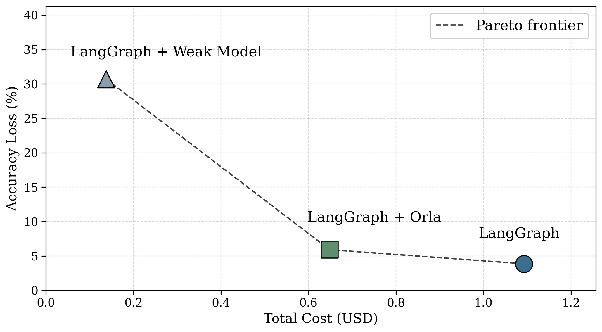

# Using Cost Policies

In Orla, cost-awareness is a first-order design primitive. LLM backends carry explicit per-token price models and quality annotations. Orla's scheduler selects among qualified backends to minimize expected spend under optional accuracy constraints, and each completed request exposes an estimated dollar cost alongside token and latency metrics. You can rely on the built-in cost-aware routing policies that ship with Orla, replace them with application-specific logic, or combine both. The serving layer stays stable while you change how each request sets its quality floor and fallback behavior. This separation is useful both for tuning production deployments and for evaluating cost–quality routing algorithms in research settings.

The core idea is straightforward. You register multiple backends with their token pricing and a quality score, then set a minimum quality target on each request. At inference time, Orla picks the cheapest backend that meets the target. Pair this with a lightweight triage step that classifies problem difficulty, and easy questions go to a small model while hard questions go to a strong one.

This page walks through a concrete example using OpenAI's [GSM8K](https://openai.com/index/solving-math-word-problems/) benchmark which consists of 1,319 grade-school math problems. We then show you how to write your own cost policy using Orla and how to track costs across your workflow.

## GSM8K using LangGraph

We evaluate a LangGraph agent on GSM8K in three configurations. In the LangGraph baseline, every problem goes to the strongest model, which yields high accuracy at high cost. In LangGraph + Orla, a cheap triage call labels difficulty, then Orla routes each solve step to the cheapest backend that still meets the requested quality floor. In LangGraph + Weak Model, every problem uses only the cheapest model, which minimizes cost but drags down accuracy.

## Results

<div style="display:flex; gap:1.5rem; flex-wrap:wrap; align-items:flex-end; justify-content:center; margin:1.5rem 0;">
  
  
</div>

LangGraph + Orla reduces the total cost by ~41% while showing only a 2% accuracy loss. Using the weak model alone reaches only 69.3% accuracy, which shows that simply switching to the cheapest model is not a viable strategy. Note that we are including the extra LLM inference for the triage stage in the cost calculation for the LangGraph + Orla configuration.

The frontier below plots accuracy loss against total cost. Lower-left is better in the figure as it corresponds to fewer mistakes and less money spent. LangGraph + Orla sits close to the strong model in accuracy but much closer to the weak model in cost.

<div style="display:flex; justify-content:center; margin:1.5rem 0;">
  
</div>

## Register backends with pricing and quality

Each backend needs two pieces of metadata: a `cost_model` that specifies token pricing (USD per million tokens for input and output), and a `quality` score between 0 and 1. The quality score is your estimate of the model's capability relative to the others. It does not need to be perfectly calibrated, just roughly ordered so that stronger models score higher.

```python
from pyorla import LLMBackend, orla_runtime
from pyorla.types import CostModel

with orla_runtime(quiet=True) as client:
    cheap = LLMBackend(
        name="gsm-cheap",
        endpoint="https://bedrock-mantle.us-east-2.api.aws/v1",
        type="openai",
        model_id="openai:mistral.ministral-3-3b-instruct",
        api_key_env_var="OPENAI_API_KEY",
        quality=0.30,
        cost_model=CostModel(
            input_cost_per_mtoken=0.10,
            output_cost_per_mtoken=0.10,
        ),
    )
    mid = LLMBackend(
        name="gsm-mid",
        endpoint="https://bedrock-mantle.us-east-2.api.aws/v1",
        type="openai",
        model_id="openai:qwen.qwen3-32b-v1:0",
        api_key_env_var="OPENAI_API_KEY",
        quality=0.60,
        cost_model=CostModel(
            input_cost_per_mtoken=0.15,
            output_cost_per_mtoken=0.60,
        ),
    )
    strong = LLMBackend(
        name="gsm-strong",
        endpoint="https://bedrock-mantle.us-east-2.api.aws/v1",
        type="openai",
        model_id="openai:qwen.qwen3-235b-a22b-2507-v1:0",
        api_key_env_var="OPENAI_API_KEY",
        quality=0.90,
        cost_model=CostModel(
            input_cost_per_mtoken=0.53,
            output_cost_per_mtoken=2.66,
        ),
    )
    for b in (cheap, mid, strong):
        client.register_backend(b)
```

All three models here are open-weight and can be self-hosted with vLLM or Ollama. This example uses [Amazon Bedrock Mantle](https://docs.aws.amazon.com/bedrock/latest/userguide/bedrock-mantle.html), but you can point `endpoint` at any OpenAI-compatible server.

## Build a triage-to-solve graph

The routed configuration adds a single LangGraph node before the solver. The triage node uses the cheap model to classify each problem as `easy`, `medium`, or `hard`. A short system prompt is enough for this; the output is a single word and costs a fraction of a cent. The solver node reads the triage label, maps it to a quality floor, and tells Orla what accuracy level is needed.

```python
from pyorla import Stage
from pyorla.types import ACCURACY_POLICY_PREFER

DIFFICULTY_TO_ACCURACY = {
    "easy": 0.30,    # cheap model qualifies
    "medium": 0.60,  # mid model qualifies
    "hard": 0.85,    # only strong model qualifies
}

triage_stage = Stage("triage", cheap)
triage_stage.client = client
triage_stage.set_temperature(0.0)
triage_stage.set_max_tokens(8)

solve_stage = Stage("solve", cheap)  # default backend; Orla overrides it
solve_stage.client = client
solve_stage.set_temperature(0.0)
solve_stage.set_max_tokens(768)
```

Inside the solve node, `set_accuracy()` passes the floor to Orla, and `set_accuracy_policy(ACCURACY_POLICY_PREFER)` tells it to pick the cheapest backend that qualifies:

```python
def solve_node(state):
    label = state.difficulty
    floor = DIFFICULTY_TO_ACCURACY.get(label, 0.85)
    solve_stage.set_accuracy(floor)
    solve_stage.set_accuracy_policy(ACCURACY_POLICY_PREFER)

    solve_llm = solve_stage.as_chat_model()
    reply = solve_llm.invoke([HumanMessage(content=prompt)])
    return {"messages": [reply]}
```

When the floor is 0.30 (an easy problem), all three backends qualify, and Orla picks `gsm-cheap` because it has the lowest token price. When the floor is 0.85 (a hard problem), only `gsm-strong` qualifies, so the problem gets the full frontier model.

The graph structure is the same you would write without Orla. The only addition is two method calls (`set_accuracy` and `set_accuracy_policy`) inside the solve node. Everything else, the state, the edges, the compilation, stays the same.

## Run the evaluation

The full runnable example lives in the Orla repo under `pyorla/examples/gsm8k_routing/`. Install dependencies and run each mode on the full test set:

```bash
cd pyorla
uv sync --group examples

uv run python examples/gsm8k_routing/run.py --mode baseline --limit 0 \
    --output-csv gsm8k_baseline.csv

uv run python examples/gsm8k_routing/run.py --mode routed --limit 0 \
    --output-csv gsm8k_routed.csv

uv run python examples/gsm8k_routing/run.py --mode all-cheap --limit 0 \
    --output-csv gsm8k_all_cheap.csv
```

Use `--limit 20` for a quick smoke test before running the full 1,319-problem evaluation. Each run writes a CSV with per-example results including `correct`, `cost_usd`, `difficulty`, and the accuracy floor sent to Orla.

## The routing decision

When a request arrives with an `accuracy` field, Orla selects the backend as follows:

1. Consider only backends that have a `cost_model` registered.
2. Among those, find the ones whose `quality` meets or exceeds the requested accuracy.
3. Sort qualifying backends by output cost per million tokens, then input cost, then name.
4. Return the cheapest one. If no backend qualifies and the policy is `prefer`, fall back to the cheapest backend overall.

You set quality scores and token pricing once when you register your backends. The only thing that changes at runtime is the `accuracy` field on each request, and the triage step handles that automatically.

## Takeaways

Orla reduced cost by 41% on GSM8K with less than 2 percentage points of accuracy loss. The routing layer is transparent to your LangGraph code. The graph still has the same shape, the same nodes, and the same compilation step. What changes is that Orla makes the backend selection for you based on the quality floor each request needs.

This approach works with any OpenAI-compatible backend, whether that is a cloud provider like Bedrock, OpenAI, or Azure, or a self-hosted engine like vLLM or Ollama. Register your model tiers with their pricing, add a triage step, and Orla handles the rest.

## Adding your own cost policy

The GSM8K example above uses a single LLM call to classify difficulty. That works, but it is just one possible policy. Orla does not prescribe how you decide the quality floor for a request. The interface is two method calls: `set_accuracy(floor)` and `set_accuracy_policy(policy)`. Everything before those calls is yours to define.

This means you can swap in any routing logic without changing the rest of your graph. A few examples of what that logic might look like:

A heuristic classifier that avoids the cost of a triage LLM call entirely:

```python
def heuristic_floor(question: str) -> float:
    words = question.split()
    numbers = sum(1 for w in words if any(c.isdigit() for c in w))
    if len(words) < 30 and numbers <= 2:
        return 0.30
    if len(words) < 60 or numbers <= 4:
        return 0.60
    return 0.85
```

A confidence-based policy that routes to the strong model only when the cheap model is uncertain:

```python
def confidence_floor(cheap_response) -> float:
    logprob = cheap_response.metrics.top_logprob
    if logprob is not None and logprob > -0.2:
        return 0.30  # cheap model is confident, keep it
    return 0.85      # uncertain, escalate to strong model
```

A learned predictor trained on your own data:

```python
def learned_floor(question: str, classifier) -> float:
    difficulty = classifier.predict(question)
    return 0.30 + 0.55 * difficulty  # continuous floor between 0.30 and 0.85
```

In each case the integration with Orla looks the same:

```python
def solve_node(state):
    floor = your_policy_function(state)
    solve_stage.set_accuracy(floor)
    solve_stage.set_accuracy_policy(ACCURACY_POLICY_PREFER)
    reply = solve_stage.as_chat_model().invoke(messages)
    return {"messages": [reply]}
```

Orla also ships with two built-in fallback behaviors when no backend meets the requested floor. `ACCURACY_POLICY_PREFER` (the default) falls back to the cheapest backend that has a cost model, so your workflow never fails due to a missing tier. `ACCURACY_POLICY_STRICT` returns an error instead, which is useful during development when you want to catch misconfigured quality scores early.

Since the policy is just a function that returns a number, you can iterate on it quickly. Run your evaluation, check the accuracy and cost columns in the CSV, adjust thresholds, and run again. There is no configuration file to edit and no deployment step between experiments. This makes Orla a practical tool for researchers who want to benchmark routing algorithms: implement your algorithm as a Python function, wire it into the solve node, and compare results across runs.

## Tracking costs

Orla attaches cost information at every level so you always know what your workflows are spending.

Every inference response includes an `estimated_cost_usd` field in its metrics. This is computed from the backend's registered token pricing and the actual prompt and completion token counts for that request. You can read it directly from the response:

```python
response = stage.execute("What is 24 * 17?")
if response.metrics and response.metrics.estimated_cost_usd is not None:
    print(f"This request cost ${response.metrics.estimated_cost_usd:.6f}")
```

When using the LangChain integration (`stage.as_chat_model()`), the cost appears in the response metadata under the same key:

```python
llm = stage.as_chat_model()
reply = llm.invoke([HumanMessage(content="What is 24 * 17?")])
cost = reply.response_metadata.get("estimated_cost_usd")
```

To sum costs across an entire workflow, accumulate the per-request values. The GSM8K evaluation script does exactly this to produce the total cost figures shown above.

For production deployments, the Orla daemon exposes Prometheus metrics at `GET /metrics`. The counter `orla_estimated_cost_usd_total` records cumulative estimated spend in USD, broken out by backend. The histogram `orla_estimated_cost_usd` captures the distribution of per-request estimated cost, also labeled by backend.

These integrate with any Prometheus-compatible monitoring stack such as [Grafana](https://grafana.com/) or [Datadog](https://www.datadoghq.com/), and give you real-time visibility into spend per backend without requiring external billing APIs. You can set alerts on cumulative cost, track per-request cost distributions over time, and break down spending by backend to see where your budget is going.
