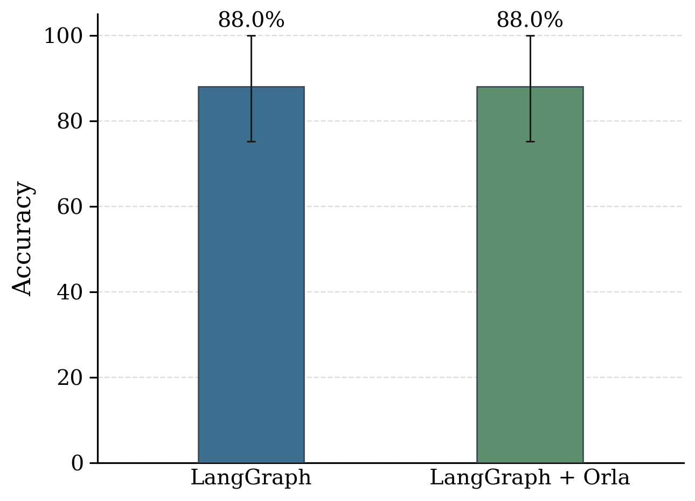
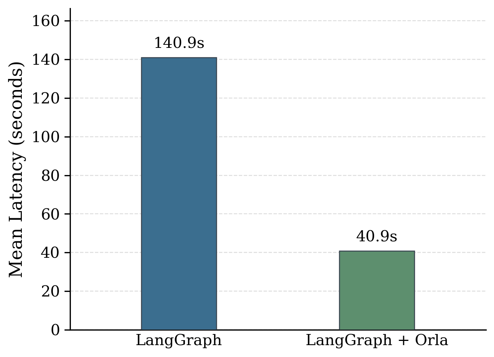
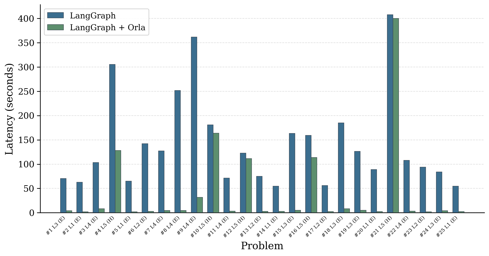

# Optimizing Latency with Orla

Orla's quality-aware stage mapping can deliver large end-to-end latency gains when models of different sizes run on dedicated hardware. A small model that generates 200 tokens per second will finish a straightforward problem in a fraction of the time a 32B-parameter model needs, but typical agentic workflows will still require the larger model for harder problem. Orla makes this trade-off automatic by allowing users to set a quality floor on each request. Orla's scheduler then picks the fastest backend that qualifies the quality floor.

This page walks through a concrete example using the [Hendrycks MATH](https://arxiv.org/abs/2103.03874) benchmark with chain-of-thought on two self-hosted vLLM backends. The evaluation shows a 3.45x mean latency reduction at the same accuracy compared to sending every problem to the strong model.

## MATH using LangGraph

We evaluate a LangGraph agent on the first 25 problems in the MATH benchmark using two open-weight models served by vLLM, Qwen3 4B and Qwen3 32B. Each model is given its own dedicated GPU, both of which are NVIDIA RTX PRO 6000 Blackwell with 96 GB of memory. The GPUs are both attached to a single machine with two AMD EPYC 7313
16-Core Processors (64 cores total, 2 threads per core) and 528 GB of
system memory, running CUDA 13.0 on Linux kernel 5.15.0.

In the LangGraph baseline, every problem goes to the Qwen3 32B model. In the LangGraph + Orla configuration, Levels 1–4 are mapped to Qwen3 4B and only Level 5 problems go to Qwen3 32B. Each problem is solved with chain-of-thought reasoning, which produces long outputs where the throughput difference between models dominates end-to-end latency.

## Results

<div style="display:flex; gap:1.5rem; flex-wrap:wrap; align-items:flex-end; justify-content:center; margin:1.5rem 0;">
  
  
</div>

LangGraph + Orla reduces mean latency from 140.9 seconds to 40.9 seconds, which is about 3.45 times faster, while matching the baseline's 88.0% accuracy. The speedup comes from the 4B model answering easy problems in 2–8 seconds instead of 55–360 seconds, with no accuracy penalty on those problems.

The per-problem view below shows the latency for each of the 25 problems. Problems labeled E (easy, Levels 1–4) are mapped to the cheap model; problems labeled H (hard, Level 5) go to the strong model. The gap on easy problems is dramatic, often 20–50x faster, while hard problems take the same time in both configurations.

<div style="display:flex; justify-content:center; margin:1.5rem 0;">
  
</div>

## Register backends with quality scores

Each backend needs a `quality` score and a `cost_model`. The quality score tells Orla the model's relative capability; the cost model drives the cheapest-qualifies selection among backends that meet the quality floor.

```python
from pyorla import LLMBackend, orla_runtime
from pyorla.types import CostModel

with orla_runtime(quiet=True, timeout=1800) as client:
    cheap = LLMBackend(
        name="math-cheap",
        endpoint="http://localhost:8001/v1",
        type="openai",
        model_id="openai:Qwen/Qwen3-4B-Instruct-2507",
        api_key_env_var="OPENAI_API_KEY",
        quality=0.30,
        cost_model=CostModel(
            input_cost_per_mtoken=0.02,
            output_cost_per_mtoken=0.02,
        ),
    )
    strong = LLMBackend(
        name="math-strong",
        endpoint="http://localhost:8000/v1",
        type="openai",
        model_id="openai:Qwen/Qwen3-32B",
        api_key_env_var="OPENAI_API_KEY",
        quality=0.90,
        cost_model=CostModel(
            input_cost_per_mtoken=0.05,
            output_cost_per_mtoken=0.15,
        ),
    )
    for b in (cheap, strong):
        client.register_backend(b)
```

Both models are open-weight and served by [vLLM](https://docs.vllm.ai/) on separate GPUs. You can use any OpenAI-compatible server; the quality and cost metadata is what Orla uses for stage mapping decisions.

## Map stages by difficulty level

The MATH dataset provides difficulty levels (1–5) for every problem. Instead of spending an LLM call on triage, map the level directly to an accuracy floor. Orla then selects the cheapest backend whose quality score meets or exceeds that floor.

```python
from pyorla import Stage
from pyorla.types import ACCURACY_POLICY_PREFER

LEVEL_TO_ACCURACY = {
    "Level 1": 0.10,
    "Level 2": 0.20,
    "Level 3": 0.30,
    "Level 4": 0.30,
    "Level 5": 0.85,
}

def solve_node(state):
    floor = LEVEL_TO_ACCURACY.get(state.difficulty, 0.85)
    solve_stage.set_accuracy(floor)
    solve_stage.set_accuracy_policy(ACCURACY_POLICY_PREFER)

    solve_llm = solve_stage.as_chat_model()
    reply = solve_llm.invoke([
        SystemMessage(content=SOLVE_SYSTEM_PROMPT),
        HumanMessage(content=state.problem),
    ])
    return {"messages": [reply]}
```

When the floor is 0.30 (Levels 1–4), both backends qualify, and Orla picks `math-cheap` because it has the lowest token price. When the floor is 0.85 (Level 5), only `math-strong` qualifies. The graph shape is unchanged from a standard LangGraph pipeline. The only additions are the two method calls `set_accuracy` and `set_accuracy_policy`.

## Run the evaluation

The full runnable example lives in the Orla repo under `pyorla/examples/math_routing_onprem/`. Install dependencies and run each mode:

```bash
cd pyorla
uv sync --group examples

uv run python examples/math_routing_onprem/run.py --mode baseline --limit 25 \
    --output-csv math_onprem_baseline.csv

uv run python examples/math_routing_onprem/run.py --mode routed --limit 25 \
    --output-csv math_onprem_routed.csv
```

Each run writes a CSV with per-example results including `correct`, `wall_clock_ms`, `difficulty`, and the accuracy floor sent to Orla.

## Why latency-based stage mapping works

The latency gain comes from the throughput gap between models. On the same GPU class, Qwen3 4B generates tokens roughly 3x faster than Qwen3 32B. Chain-of-thought math problems produce hundreds of output tokens, so generation time dominates end-to-end latency. The small model handles Level 1–4 problems reliably, so mapping those problems to it eliminates most of that generation time without sacrificing accuracy.

This generalizes to any workload where a significant fraction of requests can be handled by a smaller model, such as customer support, code completion, or document summarization. The approach works well when the models run on separate hardware so the throughput advantage is real, when a difficulty signal is available before inference (a dataset label, a heuristic, or a cheap classifier), and when the task produces enough output tokens for generation time to dominate. Short-answer tasks like factoid QA leave less room for savings because they are dominated by time-to-first-token and HTTP overhead rather than generation throughput.

## Takeaways

Orla reduced mean latency by 3.45x on the MATH benchmark at the same accuracy. The stage mapping layer is transparent to the LangGraph code. The graph still has the same shape, the same nodes, and the same compilation step. What changes is that Orla makes the backend selection for you based on the quality floor each request needs.

This complements Orla's [cost-aware stage mapping](cost-policies.md), which demonstrated a 41% cost reduction on GSM8K. The two mechanisms use the same interface (`set_accuracy` and `set_accuracy_policy`) and can be combined to cut both latency and cost simultaneously.
