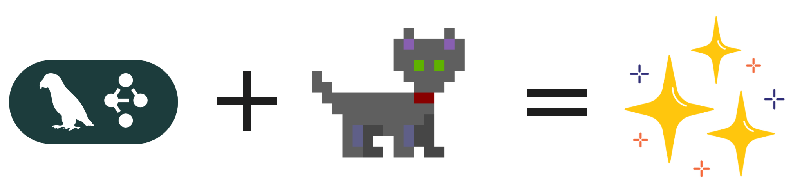
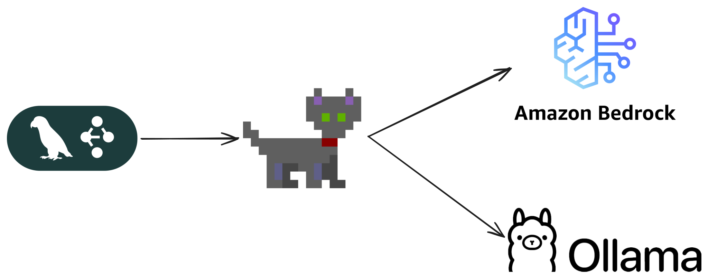
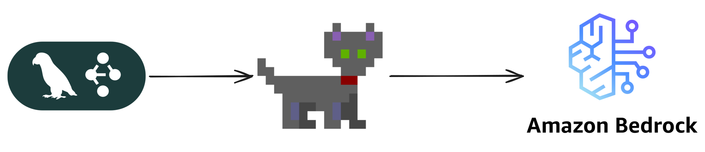
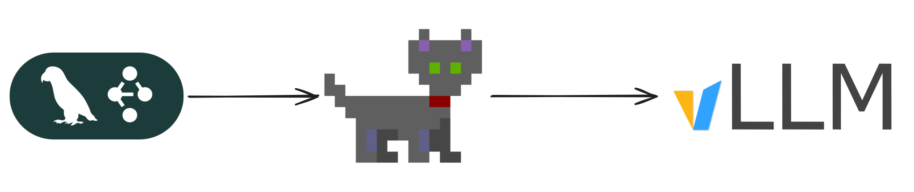

# Quickstart

Build a calculator agent with [LangGraph](https://langchain-ai.github.io/langgraph/) and route model calls through Orla. Your graph and tools stay in Python. What changes is that each LLM step goes through Orla, which lets you assign different models and backends per step.



The sections below show three setups: mixed models (the recommended starting point), cloud-only, and self-hosted. The mixed example is first because it shows what makes Orla useful: a cheap local model for triage, a larger model for the tool loop, lower cost and faster completion.

## Prerequisites

Install Orla with Homebrew:

```bash
brew install --cask harvard-cns/orla/orla
```

Install the [pyorla](https://pypi.org/project/pyorla/) package from PyPI:

```bash
pip install pyorla
```

Install the `orla` binary and ensure it is on `PATH` (or set `ORLA_BIN`). The Bedrock, self-hosted, and mixed Python snippets below, and all three runnable [`calculator_agent_*`](https://github.com/harvard-cns/orla/tree/main/pyorla/examples) scripts in the repo, start the daemon in-process with `orla_runtime()` so you do not need a separate terminal with `orla serve` while you run them. If you prefer a long-lived daemon, run `orla serve` yourself and swap `with orla_runtime(...) as client:` for `OrlaClient("http://localhost:8081")` or whatever URL you use.

Each backend section shows how to register the right `LLMBackend` values and how to set `model_with_tools` before you compile. You are expected to run the shared LangGraph tools and nodes snippets first; after that, each section picks up from the same definitions and finishes by compiling and running the graph.

## LangGraph tools

These tools are ordinary LangChain tools built with `langchain_core.tools`. They run in your Python interpreter when the graph hits the tool node. They do not go through Orla and are not registered on the daemon.

```python
from langchain_core.tools import tool

@tool
def multiply(a: int, b: int) -> int:
    """Multiply `a` and `b`.

    Args:
        a: First int
        b: Second int
    """
    return a * b

@tool
def add(a: int, b: int) -> int:
    """Adds `a` and `b`.

    Args:
        a: First int
        b: Second int
    """
    return a + b

@tool
def divide(a: int, b: int) -> float:
    """Divide `a` and `b`.

    Args:
        a: First int
        b: Second int
    """
    return a / b

tools = [add, multiply, divide]
tools_by_name = {t.name: t for t in tools}
```

Run the tools block once in your session or notebook so the `tools` list and the `tools_by_name` dictionary exist before you define nodes or backend sections.

## LangGraph nodes

The state type and the node functions are meant to be shared across every backend section in this guide. They call `model_with_tools.invoke(...)` for the LLM leg and look up `tools_by_name` when the tool node runs. Define this block once in a single place. Later, when you work through cloud, local, or mixed setups, you only supply the right `model_with_tools` binding in that section’s code before you call `compile()`.

```python
from langchain_core.messages import AnyMessage, SystemMessage, ToolMessage
from typing_extensions import Annotated, TypedDict
from typing import Literal, NotRequired
import operator

from langgraph.graph import END

class MessagesState(TypedDict):
    messages: Annotated[list[AnyMessage], operator.add]
    llm_calls: int
    triage_label: NotRequired[str]

def llm_call(state: dict):
    return {
        "messages": [
            model_with_tools.invoke(
                [
                    SystemMessage(
                        content="You are a helpful assistant tasked with performing arithmetic on a set of inputs."
                    )
                ]
                + state["messages"]
            )
        ],
        "llm_calls": state.get("llm_calls", 0) + 1,
    }

def tool_node(state: dict):
    result = []
    for tool_call in state["messages"][-1].tool_calls:
        tool = tools_by_name[tool_call["name"]]
        observation = tool.invoke(tool_call["args"])
        result.append(
            ToolMessage(content=str(observation), tool_call_id=tool_call["id"])
        )
    return {"messages": result}

def should_continue(state: MessagesState) -> Literal["tool_node", END]:
    last_message = state["messages"][-1]
    if last_message.tool_calls:
        return "tool_node"
    return END
```

In the Local and Mixed sections you wire the graph the same way at the end: an edge from `START` into `llm_call`, conditional edges from `llm_call` out to either `tool_node` or `END`, and an edge from `tool_node` back into `llm_call` so the loop can continue. The Mixed example inserts an extra node called `local_triage` at the beginning of the chain, so the first hop is `START` to `local_triage`, then `local_triage` to `llm_call`. Triage output is stored in `triage_label`, not appended as an assistant message, so the Bedrock leg still sees a user-last turn on the first calculator call. It still reuses the same `llm_call`, `tool_node`, and `should_continue` definitions you built above.

## Orla with Mixed Model Workloads

This is the setup that shows what Orla is for. Register two backends: a small local model for triage and a larger cloud model for the tool loop. Spend a little compute classifying the request, then hand the real work to the model that can handle it. Both calls go through Orla; each stage is tied to its own backend.



```python
from langchain_core.messages import HumanMessage, SystemMessage
from langgraph.graph import END, START, StateGraph
from pyorla import LLMBackend, Stage, new_ollama_backend, orla_runtime

# add code from "LangGraph Tools"
# add code from "LangGraph Nodes"

with orla_runtime(quiet=True) as client:
    local_backend = new_ollama_backend("qwen3:0.6b", "http://127.0.0.1:11434")
    client.register_backend(local_backend)

    bedrock_backend = LLMBackend(
        name="bedrock-mantle",
        endpoint="https://bedrock-mantle.us-east-2.api.aws/v1",
        type="openai",
        model_id="openai:mistral.ministral-3-3b-instruct",
        api_key_env_var="OPENAI_API_KEY",
    )
    client.register_backend(bedrock_backend)

    local_stage = Stage("triage", local_backend)
    local_stage.client = client
    local_stage.set_max_tokens(32)
    local_stage.set_temperature(0)
    local_llm = local_stage.as_chat_model()

    calculator_stage = Stage("calculator", bedrock_backend)
    calculator_stage.client = client
    calculator_stage.set_max_tokens(512)
    calculator_stage.set_temperature(0)
    model_with_tools = calculator_stage.as_chat_model().bind_tools(tools)

    def local_triage(state: dict):
        """One local LLM call through Orla (no tools)."""
        user = state["messages"][-1]
        r = local_llm.invoke(
            [
                SystemMessage(
                    content="Reply with exactly one word: ARITHMETIC or OTHER."
                ),
                user,
            ]
        )
        return {
            "triage_label": (r.content or "").strip(),
            "llm_calls": state.get("llm_calls", 0) + 1,
        }

    agent_builder = StateGraph(MessagesState)
    agent_builder.add_node("local_triage", local_triage)
    agent_builder.add_node("llm_call", llm_call)
    agent_builder.add_node("tool_node", tool_node)

    agent_builder.add_edge(START, "local_triage")
    agent_builder.add_edge("local_triage", "llm_call")
    agent_builder.add_conditional_edges(
        "llm_call",
        should_continue,
        ["tool_node", END],
    )
    agent_builder.add_edge("tool_node", "llm_call")

    agent = agent_builder.compile()

    out = agent.invoke({"messages": [HumanMessage(content="Add 3 and 4.")]})
    for m in out["messages"]:
        m.pretty_print()
```

Runnable end-to-end scripts for each backend live in the Orla repo under `pyorla/examples/`: [`calculator_agent_mixed/run.py`](https://github.com/harvard-cns/orla/blob/main/pyorla/examples/calculator_agent_mixed/run.py), [`calculator_agent_cloud/run.py`](https://github.com/harvard-cns/orla/blob/main/pyorla/examples/calculator_agent_cloud/run.py), and [`calculator_agent_vllm/run.py`](https://github.com/harvard-cns/orla/blob/main/pyorla/examples/calculator_agent_vllm/run.py).

## Orla with Cloud Models

This guide uses [Amazon Bedrock](https://aws.amazon.com/bedrock/) through its OpenAI-compatible HTTP API: region hosts look like `https://bedrock-mantle.<region>.api.aws/v1`, and AWS documents that surface as [Bedrock Mantle](https://docs.aws.amazon.com/bedrock/latest/userguide/bedrock-mantle.html). In pyorla you represent that endpoint with `LLMBackend`, set `type="openai"`, and use a model id string of the form `openai:<model-id>` so Orla knows which Bedrock model to call.



Create a [Bedrock API key](https://docs.aws.amazon.com/bedrock/latest/userguide/api-keys.html) and export it as `OPENAI_API_KEY` in the shell where you launch Python. The snippet below uses `orla_runtime()`, which starts a child `orla` process for you. That child must inherit `OPENAI_API_KEY` from the environment when it starts, because the daemon uses it when it calls Bedrock on your behalf.

Complete the [LangGraph tools](#langgraph-tools) and [LangGraph nodes](#langgraph-nodes) sections first, then run the Python block that follows. The block starts the daemon with `orla_runtime()`, registers Bedrock at `https://bedrock-mantle.us-east-2.api.aws/v1` with a small default instruct model, builds the same `StateGraph` shape as in the Local section, invokes the graph, and prints each message. Adjust `endpoint` and `model_id` in the `LLMBackend` constructor if your account uses another region or another model. The Local and Mixed sections use the same `orla_runtime()` pattern.

```python
from langchain_core.messages import HumanMessage
from langgraph.graph import END, START, StateGraph
from pyorla import LLMBackend, Stage, orla_runtime

# add code from "LangGraph Tools"
# add code from "LangGraph Nodes"

with orla_runtime(quiet=True) as client:
    bedrock = LLMBackend(
        name="bedrock-mantle",
        endpoint="https://bedrock-mantle.us-east-2.api.aws/v1",
        type="openai",
        model_id="openai:mistral.ministral-3-3b-instruct",
        api_key_env_var="OPENAI_API_KEY",
    )
    client.register_backend(bedrock)

    stage = Stage("calculator", bedrock)
    stage.client = client
    stage.set_max_tokens(512)
    stage.set_temperature(0)
    model_with_tools = stage.as_chat_model().bind_tools(tools)

    agent_builder = StateGraph(MessagesState)
    agent_builder.add_node("llm_call", llm_call)
    agent_builder.add_node("tool_node", tool_node)
    agent_builder.add_edge(START, "llm_call")
    agent_builder.add_conditional_edges(
        "llm_call",
        should_continue,
        ["tool_node", END],
    )
    agent_builder.add_edge("tool_node", "llm_call")
    agent = agent_builder.compile()

    out = agent.invoke({"messages": [HumanMessage(content="Add 3 and 4.")]})
    for m in out["messages"]:
        m.pretty_print()
```

## Orla with Self-Hosted Models

In the self-hosted setup, Orla and your Python process run on the same physical or virtual machine. The weights live in a separate program, typically vLLM or another OpenAI-compatible server, which listens on a local HTTP port (8000 is a common default for vLLM). When you register that server as a backend, use a URL that Orla on the host can actually open. In practice that often means `http://127.0.0.1:...` rather than a Docker-only hostname that resolves inside a container network but not from the host where `orla serve` runs.



If you operate vLLM yourself, turn on tool calling in the server flags so the model can emit tool calls in a format Orla and LangChain expect. A typical starting point is `--enable-auto-tool-choice` together with a `--tool-call-parser` that matches your model family. Orla’s [Compose file](https://github.com/harvard-cns/orla/blob/main/deploy/docker-compose.vllm.yaml) documents one combination that works with Qwen.

```python
from langchain_core.messages import HumanMessage
from langgraph.graph import END, START, StateGraph
from pyorla import Stage, new_vllm_backend, orla_runtime

# add code from "LangGraph Tools"
# add code from "LangGraph Nodes"

with orla_runtime(quiet=True) as client:
    local = new_vllm_backend(
        "Qwen/Qwen3-4B-Instruct-2507",
        "http://127.0.0.1:8000/v1",
    )
    client.register_backend(local)

    stage = Stage("calculator", local)
    stage.client = client
    stage.set_max_tokens(512)
    stage.set_temperature(0)
    model_with_tools = stage.as_chat_model().bind_tools(tools)

    agent_builder = StateGraph(MessagesState)
    agent_builder.add_node("llm_call", llm_call)
    agent_builder.add_node("tool_node", tool_node)
    agent_builder.add_edge(START, "llm_call")
    agent_builder.add_conditional_edges(
        "llm_call",
        should_continue,
        ["tool_node", END],
    )
    agent_builder.add_edge("tool_node", "llm_call")
    agent = agent_builder.compile()

    out = agent.invoke({"messages": [HumanMessage(content="Add 3 and 4.")]})
    for m in out["messages"]:
        m.pretty_print()
```

If you prefer Ollama, you can substitute `new_ollama_backend("your-model", "http://127.0.0.1:11434")` for `new_vllm_backend` in the Local section, as long as the model you pick supports tool calling well enough for your graph.